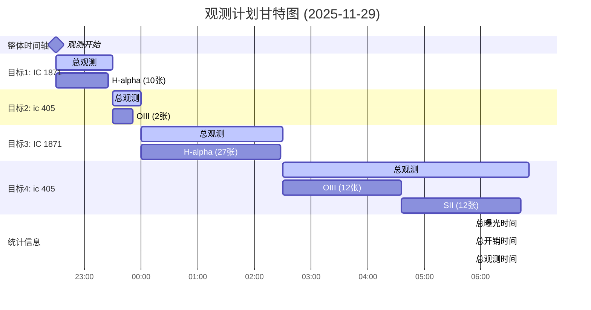

## 观测计划统计
- **总曝光时间**: 7.5 小时
- **总开销时间**: 1.1 小时
- **总观测时间**: 8.3 小时
- **效率**: 90.3%

## 目标详情
### 目标1: IC 1871
- **坐标**: RA=02:53:19.50, DEC=60:26:59.1
- **开始时间**: 2025-11-29 22:30:00
- **结束时间**: 2025-11-29 23:30:00
- **持续时间**: 1.0 小时
- **曝光时间**: 0.9 小时
- **优先级**: 1

**滤镜拍摄计划**:
- H-alpha: 10张 × 300秒 = 50.0分钟

### 目标2: ic 405
- **坐标**: RA=05:16:30.00, DEC=34:21:00.0
- **开始时间**: 2025-11-29 23:30:00
- **结束时间**: 2025-11-30 00:00:00
- **持续时间**: 0.5 小时
- **曝光时间**: 0.5 小时
- **优先级**: 2

**滤镜拍摄计划**:
- OIII: 2张 × 600秒 = 20.0分钟

### 目标3: IC 1871
- **坐标**: RA=02:53:19.50, DEC=60:26:59.1
- **开始时间**: 2025-11-30 00:00:00
- **结束时间**: 2025-11-30 02:30:00
- **持续时间**: 2.5 小时
- **曝光时间**: 2.2 小时
- **优先级**: 1

**滤镜拍摄计划**:
- H-alpha: 27张 × 300秒 = 135.0分钟

### 目标4: ic 405
- **坐标**: RA=05:16:30.00, DEC=34:21:00.0
- **开始时间**: 2025-11-30 02:30:00
- **结束时间**: 2025-11-30 06:51:00
- **持续时间**: 4.3 小时
- **曝光时间**: 4.0 小时
- **优先级**: 2

**滤镜拍摄计划**:
- OIII: 12张 × 600秒 = 120.0分钟
- SII: 12张 × 600秒 = 120.0分钟
