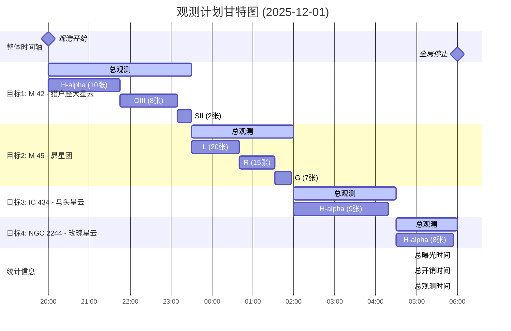

## 观测计划统计
- **总曝光时间**: 10.8 小时
- **总开销时间**: 1.5 小时
- **总观测时间**: 10.0 小时
- **效率**: 108.3%

## 目标详情
### 目标1: M 42 - 猎户座大星云
- **坐标**: RA=05:35:17.3, DEC=-05:23:16.0
- **开始时间**: 2025-12-01 20:00:00
- **结束时间**: 2025-12-01 23:30:00
- **持续时间**: 3.5 小时
- **曝光时间**: 3.2 小时
- **优先级**: 1

**滤镜拍摄计划**:
- H-alpha: 10张 × 600秒 = 100.0分钟
- OIII: 8张 × 600秒 = 80.0分钟
- SII: 2张 × 600秒 = 20.0分钟

### 目标2: M 45 - 昴星团
- **坐标**: RA=03:47:24.0, DEC=+24:07:00.0
- **开始时间**: 2025-12-01 23:30:00
- **结束时间**: 2025-12-02 02:00:00
- **持续时间**: 2.5 小时
- **曝光时间**: 2.1 小时
- **优先级**: 2

**滤镜拍摄计划**:
- L: 20张 × 180秒 = 60.0分钟
- R: 15张 × 180秒 = 45.0分钟
- G: 7张 × 180秒 = 21.0分钟

### 目标3: IC 434 - 马头星云
- **坐标**: RA=05:40:59.0, DEC=-02:27:30.0
- **开始时间**: 2025-12-02 02:00:00
- **结束时间**: 2025-12-02 04:30:00
- **持续时间**: 2.5 小时
- **曝光时间**: 2.4 小时
- **优先级**: 3

**滤镜拍摄计划**:
- H-alpha: 9张 × 900秒 = 135.0分钟

### 目标4: NGC 2244 - 玫瑰星云
- **坐标**: RA=06:32:00.0, DEC=+04:52:00.0
- **开始时间**: 2025-12-02 04:30:00
- **结束时间**: 2025-12-02 06:00:00
- **持续时间**: 1.5 小时
- **曝光时间**: 3.2 小时
- **优先级**: 4

**滤镜拍摄计划**:
- H-alpha: 8张 × 600秒 = 80.0分钟
