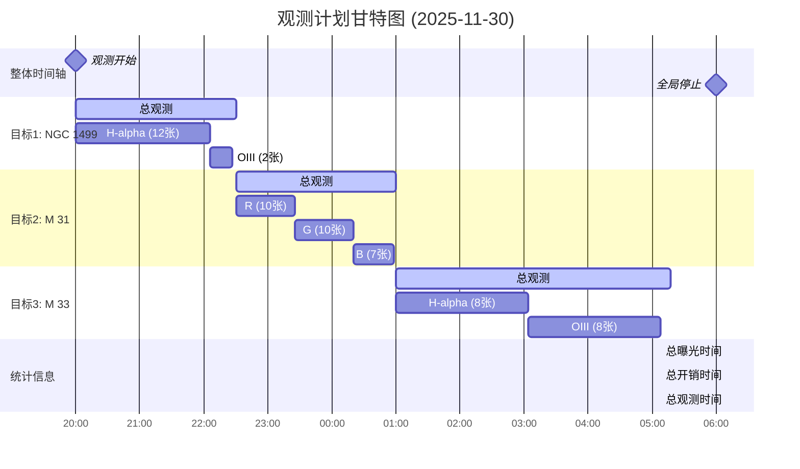

## 观测计划统计
- **总曝光时间**: 8.5 小时
- **总开销时间**: 1.1 小时
- **总观测时间**: 9.3 小时
- **效率**: 91.5%

## 目标详情
### 目标1: NGC 1499
- **坐标**: RA=04:01:07.51, DEC=+36:31:11.9
- **开始时间**: 2025-11-30 20:00:00
- **结束时间**: 2025-11-30 22:30:00
- **持续时间**: 2.5 小时
- **曝光时间**: 2.3 小时
- **优先级**: 1

**滤镜拍摄计划**:
- H-alpha: 12张 × 600秒 = 120.0分钟
- OIII: 2张 × 600秒 = 20.0分钟

### 目标2: M 31
- **坐标**: RA=00:42:44.33, DEC=+41:16:07.5
- **开始时间**: 2025-11-30 22:30:00
- **结束时间**: 2025-12-01 01:00:00
- **持续时间**: 2.5 小时
- **曝光时间**: 2.2 小时
- **优先级**: 2

**滤镜拍摄计划**:
- R: 10张 × 300秒 = 50.0分钟
- G: 10张 × 300秒 = 50.0分钟
- B: 7张 × 300秒 = 35.0分钟

### 目标3: M 33
- **坐标**: RA=01:33:50.89, DEC=+30:39:35.8
- **开始时间**: 2025-12-01 01:00:00
- **结束时间**: 2025-12-01 05:17:00
- **持续时间**: 4.3 小时
- **曝光时间**: 4.0 小时
- **优先级**: 3

**滤镜拍摄计划**:
- H-alpha: 8张 × 900秒 = 120.0分钟
- OIII: 8张 × 900秒 = 120.0分钟
